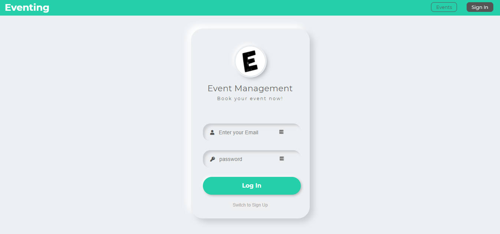

<h1>Eventing - Event Management Web Application - Server</h1>

<br />

<!-- PROJECT LOGO -->
<p  align="center">
    <a href="#">
        
    </a>
</p>

<!-- ABOUT THE PROJECT -->

## About The Project

Eventing ( Event Management Website ) is the application of project management to the creation and development of small and/or large-scale personal or corporate events such as festivals, conferences, ceremonies, weddings, formal parties, concerts, or conventions.

<!-- Screenshot -->



[Eventing (Link)](https://event-management-graphql.netlify.app/)

<!-- Built with section -->

## Built With

### Frameworks

- [GraphQL](https://graphql.org/)
- [Express](https://expressjs.com/)
- [Node](https://nodejs.org/en/)
- [MongoDB](https://www.mongodb.com/)

### Add-Ons/Plugins:

- [bcryptjs](https://www.npmjs.com/package/bcryptjs)
- [dataloader](https://www.npmjs.com/package/dataloader)
- [cors](https://www.npmjs.com/package/cors)
- [dotenv](https://www.npmjs.com/package/dotenv)
- [express](https://www.npmjs.com/package/express)
- [graphql](https://www.npmjs.com/package/graphql)
- [jsonwebtoken](https://www.npmjs.com/package/jsonwebtoken)
- [mongoose](https://www.npmjs.com/package/mongoose)
- [express-graphql](https://www.npmjs.com/package/express-graphql)
- [body-parser](https://www.npmjs.com/package/body-parser)

<!-- GETTING STARTED -->
# Getting Started

### Prerequisites

You will need a node in your system.

- npm

  ```sh
  npm install npm@latest -g
  ```

- Verify Installation
  ```sh
  node -v
  ```

### Installation

1. Clone the Front-End repo

   ```sh
   git clone https://github.com/thearpitanand/event-booking-client
   ```

2. Clone the Back-End repo

   ```sh
   git clone https://github.com/thearpitanand/event-booking-server
   ```

3. Install NPM packages

   ```sh
   npm i
   ```

4. Create `.env` file then enter your API.

   ```sh
   MONGO_DB_USER="Database User"
   MONGO_DB_PASSWORD="Database Password"
   MONGO_DB_Name="Database Name"
   JWT_SecretKey="Secret key"
   ```

5. Run the app in the development mode.

   ```sh
   npm run dev
   ```

6. Open [http://localhost:8000](http://localhost:8000) to view it in the browser.

<!-- Test Details -->

## Test Details

### User Id, Password

- ID
  ```sh
  test.user@eventing.com
  ```
- Password
  ```sh
  eventing
  ```

<!-- Disclaimer -->

## DISCLAIMER

Your suggestions are highly acknowledged. [Open issue](https://github.com/thearpitanand/event-booking-server/issues)

<!-- CONTACT -->

## Contact

Name - Arpit Anand\
Unsplash - [@thearpitanand](https://unsplash.com/@thearpitanand)\
Twitter - [the_arpitanand](https://twitter.com/the_arpitanand)\
LinkedIn - [thearpitanand](https://www.linkedin.com/in/thearpitanand/)\
Instagram - [anand_arpit](https://www.instagram.com/anand_arpit/)\
Project Link: [Front - End](https://github.com/thearpitanand/event-booking-client), [Back - End](https://github.com/thearpitanand/event-booking-server)